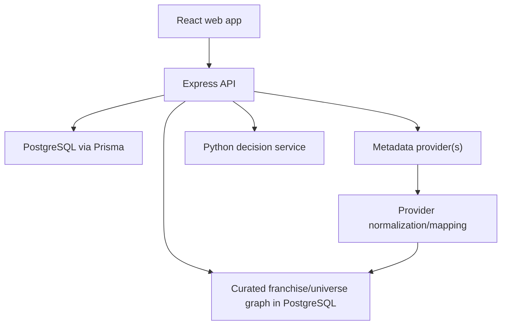

# Planned architecture

## Boundaries
**Web:** presentation, accessible forms, local interaction state and calls to public API contracts. No provider secrets or database access.
**API:** authentication, authorization, validation, catalog adapter, tracking, statistics, recommendation orchestration.
**PostgreSQL:** authoritative users, normalized catalog references, watchlists and viewing records.
**Decision service:** ranks supplied eligible candidates and returns scores/reasons. It does not own authentication or write viewing records.
**Provider adapter:** isolates external response shapes, caching, quota handling and attribution requirements.
**Franchise/universe domain:** first-party versioned collection hierarchy, memberships, watch orders and title relations stored in PostgreSQL. Provider collections/relations may seed mappings but do not define Scenic truth automatically.

## Proposed repository layout
- apps/web/ — React application
- apps/api/ — Express API and Prisma migrations
- services/decision/ — Python/FastAPI service
- packages/contracts/ — shared public schemas if useful
- docs/ — maintained design and delivery documents

These application directories are proposed and do not yet exist.

## Request flow
API authenticates the user, loads their history, obtains a bounded candidate pool, strips identifying fields, calls the decision service, validates results, and returns approved title IDs with reasons. Reject unknown result IDs.

For franchise/universe progress, the API loads the selected versioned collection graph, resolves eligible released members, joins authoritative movie/episode history, derives progress and next-item guidance under the selected watch order, and returns the denominator policy with the result. The Python service may consume this derived state but never owns collection membership or personal watch history.

## Failure behavior
Provider failure: return cached metadata where permitted, or a retryable error; keep stored history available.
Decision failure: return a deterministic API fallback from the eligible candidate pool and identify the fallback source.
Database failure: return a safe service error; never report a write as saved.
Use bounded retries only for safe transient reads. Avoid blind retries of non-idempotent writes.

## Deployment principles
Web and API may be deployed separately. Database and decision service should be private where hosting permits. Migrations execute as a controlled release step. Hosting provider and exact runtime versions remain TBD.
